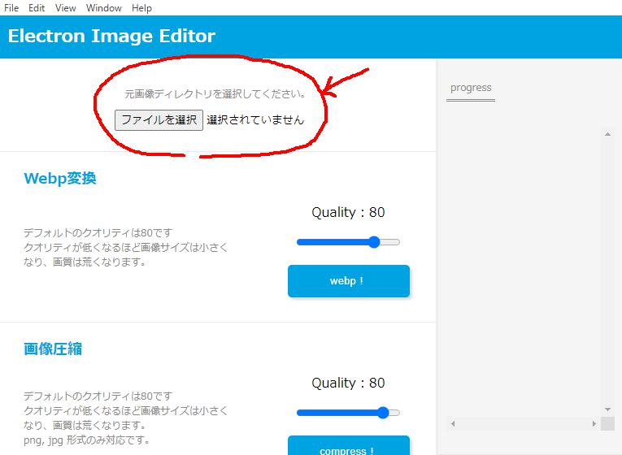

# Electron Image Editor

## 使用方法

変換を行いたい画像のあるフォルダを選択してください。  
※ ドラック&ドロップで選択を行うとエラーになってしまうので注意が必要です。

Webp変換を行うと、`webp`フォルダが変換元のフォルダと同じ階層に作成されます。  
画像圧縮を行うと、`compressed`フォルダが変換元のフォルダと同じ階層に作成されます。  
画像リサイズを行うと、`resized`フォルダが変換元のフォルダと同じ階層に作成されます。